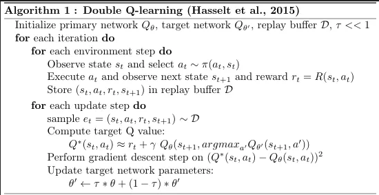
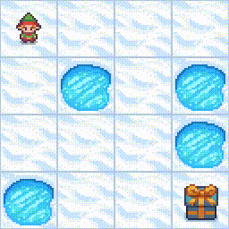
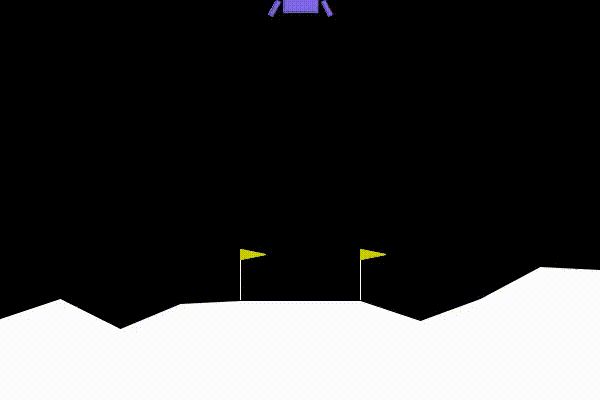

# Reinforcement Learning: Gymnasium Library

This repository showcases implementations of reinforcement learning algorithms applied to environments of the Gymnasium library.

## Environments

The following evironments are (or will be) used:
- [Frozen Lake]()
- [Lunar Lander]()

## Results

<table>
  <tr>
    <th>Name</th>
    <th>Algorithm</th>
    <th>Solved Demo</th>
  </tr>
  <tr>
    <td><b><a href="https://proceedings.neurips.cc/paper_files/paper/2010/file/091d584fced301b442654dd8c23b3fc9-Paper.pdf" target="_blank"> DQL </a></b></td>
    <td></td>
    <td></td>
  </tr>

  <tr>
    <td><b><a href="https://doi.org/10.48550/arXiv.1707.06347" target="_blank"> PPO Clip </a></b></td>
    <td></td>
    <td></td>
  </tr>
</table>

